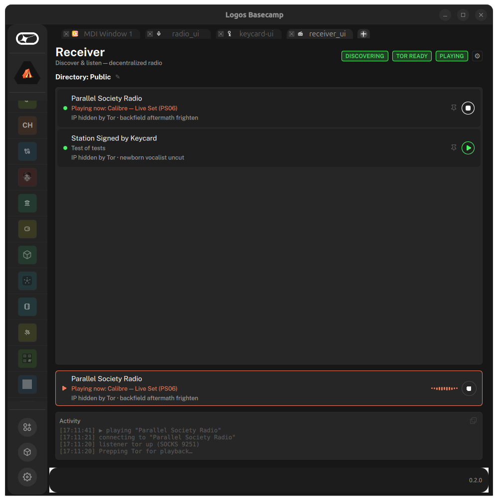
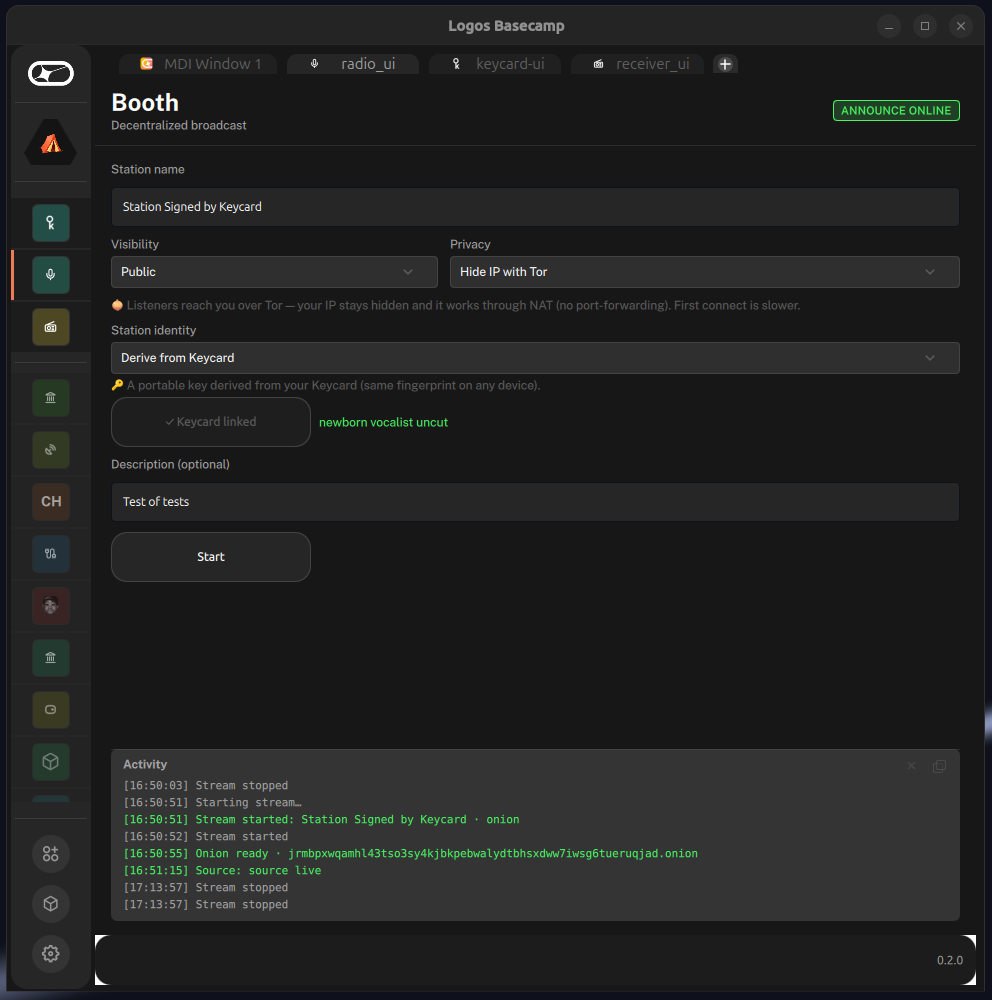
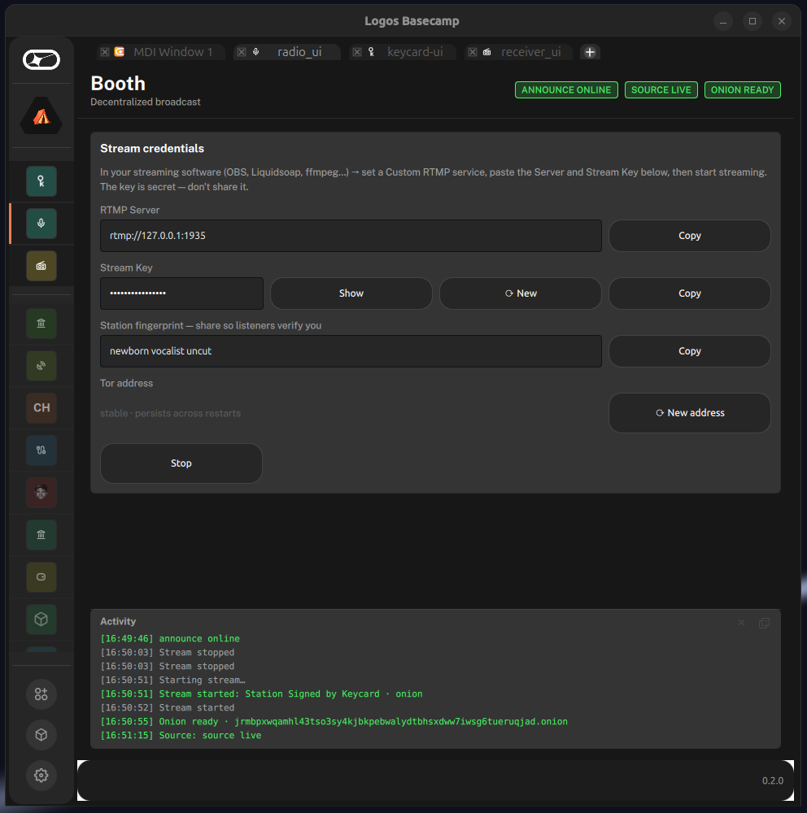

# receiver-basecamp

A lightweight **listen-only** Logos Basecamp module: discover decentralized radio broadcasts over
**LogosMessaging** (`delivery_module`) and play them over Tor — no hosting, no MediaMTX, no hidden
service. It's a single **`ui_qml` module with a C++ backend** (the `logos-delivery-demo` shape), so
the delivery client lives in the **ui-host** process. Interops with live `radio-basecamp` hosts.

> **📦 Install:** grab the signed **[v0.2.0.4 release](https://github.com/xAlisher/receiver-basecamp/releases/tag/v0.2.0.4)**
> (`receiver_ui-0.2.0.4-linux-amd64.lgx`, ✓ Signed by xAlisher) — see [Quick start](#quick-start-cold-agent-linux-x86-64).
> Adds a **first-launch dependency preflight** (#55) — if `tor`/`ffplay`/`torsocks` are missing, a card shows a
> checklist + copy-able install command + Re-check (no more silent "playback failed"); drops the `Playing now:` prefix.
> Universal API (`modules().delivery_module`), no legacy `getClient`. Validated on Basecamp v0.2.0:
> discovery + connection pill + `.onion` audio.

---

## Install

### 1. Add the catalog & install the module (in Basecamp)

1. **Settings ▸ Repositories**
2. **Add a repository** → paste
   `https://raw.githubusercontent.com/xAlisher/logos-basecamp-modules/main/logos-repo.json`
   → press **Add**
3. Go to **Application**, scroll to **xAlisher's Logos Modules**
4. Press **Receiver_ui**
5. Press **Install**

> `delivery_module` is pulled in automatically as a dependency.

### 2. Install external runtime dependencies (in a terminal)

`.onion` playback needs **Tor**, **ffmpeg** (`ffplay`), and a SOCKS shim on your `PATH`.

**Linux (Debian/Ubuntu)**
```bash
sudo apt install -y tor torsocks ffmpeg
```

**macOS (Apple Silicon)** — uses **privoxy**, not torsocks (torsocks' `LD_PRELOAD` shim is SIP-blocked; `.onion` plays through a privoxy→Tor bridge). Two steps:

**Step 1 — install the helpers.** Pick the one you use:
```bash
# Homebrew (most macs — get it at https://brew.sh if you don't have it):
brew install tor ffmpeg privoxy

# …OR Nix, if you already run it:
nix profile install nixpkgs#tor nixpkgs#ffmpeg nixpkgs#privoxy
```

**Step 2 — point Receiver at them (required).** macOS GUI apps get a minimal `PATH` that excludes both `/opt/homebrew/*` and `~/.nix-profile/bin`, so Receiver can't find the helpers on `PATH`. Set **explicit** paths (do **not** use `$(which …)` — it can print a stale/removed path, and Homebrew's `privoxy` is in `sbin`, usually off `PATH`):
```bash
# If you used Homebrew (Apple Silicon — Intel macs: /usr/local/bin + /usr/local/sbin):
launchctl setenv RECEIVER_TOR_BIN     /opt/homebrew/bin/tor
launchctl setenv RECEIVER_FFPLAY_BIN  /opt/homebrew/bin/ffplay
launchctl setenv RECEIVER_PRIVOXY_BIN /opt/homebrew/sbin/privoxy

# …OR if you used Nix:
launchctl setenv RECEIVER_TOR_BIN     "$HOME/.nix-profile/bin/tor"
launchctl setenv RECEIVER_FFPLAY_BIN  "$HOME/.nix-profile/bin/ffplay"
launchctl setenv RECEIVER_PRIVOXY_BIN "$HOME/.nix-profile/bin/privoxy"
```
Then **fully quit and relaunch Basecamp** and press **Re-check** in the dependency card — it should clear.

> Have both Nix *and* Homebrew? Point at whichever binary actually exists (`ls -l <path>`) — a removed Nix package can leave a dangling `~/.nix-profile/bin/<tool>` that `$(which)` still prints.

---

## 📸 Screenshots

**Receiver** — verified stations render `IP hidden by Tor · <PGP fingerprint>`; pin-by-identity, stop-from-row,
now-playing from broadcaster metadata, and a live player bar. Here two signed stations (an autogen PSR and a
Keycard-signed station) play with their fingerprints shown:



**Booth** (the broadcaster, [booth-basecamp](https://github.com/xAlisher/booth-basecamp)) — sign your station
with an **Autogenerated** or **Keycard**-derived identity. The fingerprint (`newborn vocalist uncut`) is your
out-of-band anchor — share it so listeners pin the *right* key:




## ✅ Platform status — works on v0.2.0 / v0.2.1

> **macOS users:** the universal `receiver_ui` is **verified working on the released macOS Basecamp v0.2.1**
> (Apple Silicon) — discovery, identity verification, pin, and `.onion` playback (via the privoxy bridge).
> See [**macOS (arm64)**](#macos-arm64--verified-working-on-released-v021) below for install + deps.

**On Linux this module is verified on Basecamp `v0.2.0` (2026-07-04):** discovery starts, the delivery node
connects, and the design-system UI renders. **`v0.2.1` is the latest host release** — it's a bug-fix release
(module-shutdown, package-manager, and Linux UI fixes) with **no delivery/API/module-loading changes**, so
`receiver_ui` behaves identically on it (verified on macOS `v0.2.1`; not separately re-run on a Linux
`v0.2.1` host). The old **268-only** restriction is **lifted** — the v0.2 platform migration resolved the
`getClient("delivery_module")` hang that used to park pre-v0.2 (295-era) builds. Run it on any `v0.2.0`+ AppImage.

<details><summary>Historical — the pre-v0.2 "268-only" <code>getClient</code> hang (resolved)</summary>

Before v0.2, `getClient("delivery_module")` **hung forever** on the 295-era build (`2cb9985c`) — the
ui-host thread parked in `poll()` waiting for a capability/QRO reply that never arrived. A
delivery-specific platform regression (`getClient("storage_module")` worked), tracked as
**[logos-basecamp#150](https://github.com/logos-co/logos-basecamp/issues/150)** /
**[logos-delivery-module#31](https://github.com/logos-co/logos-delivery-module/issues/31)**. Proof at
the time: same module + byte-identical `delivery_module.so` (`d872f77c`) + same profile → `getClient`
returned in ~1 ms on the 268 build (`ef6dca8b`), hung on 295; only the AppImage differed. The module was
pinned to 268 until the v0.2 bootstrap fix. Kept for archaeology.

</details>

---

## macOS (arm64) — verified working on released v0.2.1

**Status (2026-07-05): the universal `receiver_ui` runs on the released macOS Basecamp `v0.2.1`** —
discovery, station-identity verification, pin, and `.onion` playback all work on an Apple-Silicon Mac.
(The old "relay architecture" + "needs a `logos-app master` host" notes are obsolete: the #20 universal-API
migration collapsed the relay into a single QtRO-backed `receiver_ui`, and the released v0.2.1 host runs it.)

### 1. Install the macOS Basecamp host
Download the latest signed desktop app (`LogosBasecamp-Desktop-*-aarch64.dmg`) and drag it to `/Applications`:
```bash
open "https://github.com/logos-co/logos-app/releases/latest"
```

### 2. Runtime dependencies — tor · ffmpeg · **privoxy**
`.onion` playback needs **tor**, **ffmpeg** (`ffplay`) and **privoxy**. macOS has **no working `torsocks`**
(SIP blocks its `DYLD_INSERT_LIBRARIES` shim), so the receiver routes Tor through a local **privoxy
HTTP→SOCKS bridge** instead (`forward-socks5t` → the listener Tor; remote DNS, no IP/DNS leak). Install:
```bash
nix profile install nixpkgs#tor nixpkgs#ffmpeg nixpkgs#privoxy     # or:  brew install tor ffmpeg privoxy
```
macOS GUI apps get a minimal `PATH` (no `~/.nix-profile/bin` / `/opt/homebrew/bin`), so point the receiver
at the bins with `launchctl setenv` (persists across relaunch) — then relaunch Basecamp:
```bash
launchctl setenv RECEIVER_TOR_BIN     "$(which tor)"
launchctl setenv RECEIVER_FFPLAY_BIN  "$(which ffplay)"
launchctl setenv RECEIVER_PRIVOXY_BIN "$(which privoxy)"
```

### 3. Install delivery_module + the receiver
`receiver_ui` depends on **`delivery_module`**, which the desktop `.dmg` does **not** bundle — install it
from the in-app **Package Manager** (delivery_module **0.1.3**). Then install the receiver's darwin `.lgx`:
```bash
PROF="$HOME/Library/Application Support/Logos/LogosBasecamp"
lgpm --modules-dir "$PROF/modules" --ui-plugins-dir "$PROF/plugins" --allow-unsigned \
     install --file receiver_ui-0.2.0.2-darwin-arm64.lgx
printf darwin-arm64 > "$PROF/plugins/receiver_ui/variant"
```
Build that darwin `.lgx` with `nix build .#lgx-portable` on an Apple-Silicon Mac (secp256k1 + tor helpers
bundle automatically) — see [docs/MACOS-BUILD-PROTOCOL.md](docs/MACOS-BUILD-PROTOCOL.md).

### 4. Run
Launch Basecamp → open **Receiver** → stations appear (~10–15s) → **Play** (first `.onion` play takes
~10–30s while the listener Tor bootstraps). Verified stations render `IP hidden by Tor · <fingerprint>`.

---

## Quick start (cold agent, Linux x86-64)

```bash
# 0. Runtime deps on PATH (playback helpers — see "Runtime dependencies" below)
sudo apt install -y tor torsocks ffmpeg

# 1. Use a current Basecamp AppImage (v0.2.0+ — delivery getClient works since the v0.2 migration).
#    On this machine: ~/logos-basecamp-current.AppImage (-> v0.2.0). The old 268-only pin is lifted;
#    pre-v0.2 (295-era) builds hung getClient — see the "Platform status" section above.

# 2. Use a MINIMAL ISOLATED profile (delivery_module + receiver_ui only) to keep startup fast.
export XDG_DATA_HOME="$HOME/.local/share/Logos-radio-only"
PROF="$XDG_DATA_HOME/Logos/LogosBasecamp"

# 3. Install the SIGNED LGX from the v0.2.0.4 release (✓ Signed by xAlisher — no --allow-unsigned).
curl -fL -o receiver_ui-0.2.0.4-linux-amd64.lgx \
  https://github.com/xAlisher/receiver-basecamp/releases/download/v0.2.0.4/receiver_ui-0.2.0.4-linux-amd64.lgx
LGPM=$(command -v lgpm || echo /path/to/lgpm)   # logos-package-manager CLI
"$LGPM" --modules-dir "$PROF/modules" --ui-plugins-dir "$PROF/plugins" \
        install --file receiver_ui-0.2.0.4-linux-amd64.lgx
printf 'linux-amd64' > "$PROF/plugins/receiver_ui/variant"   # select the variant
#   (or build from source instead of downloading: nix build .#lgx-portable — see "Build from source")

# 4. Launch (only ONE Basecamp at a time — instances share delivery TCP port 60000).
XDG_RUNTIME_DIR=/run/user/$(id -u) WAYLAND_DISPLAY=wayland-0 \
  nohup "$HOME/logos-basecamp-radio-only.AppImage" >/tmp/recv.log 2>&1 &

# 5. Open the "Receiver" panel in the sidebar → it discovers live stations → tap one to play.
```

`delivery_module` is auto-resolved from `metadata.json` `dependencies` and must be present in
`$PROF/modules/` (it ships with the AppImage; copy it into the isolated profile if missing).

On this machine, `scripts/launch-radio-only.sh` does steps 2+4 against the reserved
`~/logos-basecamp-radio-only.AppImage` (268) + `Logos-radio-only` profile. **Do not** repoint other
Basecamp work at that AppImage/profile — they're reserved for this demo.

## Runtime dependencies (per-OS, on PATH)

Playback spawns helpers resolved via `resolveBin()` (env override → PATH). The module runs its **own
listener tor** (its own `SocksPort`, not the system service) and plays `.onion` via `torsocks ffplay`,
direct URLs via `ffplay`.

| OS | Install |
|----|---------|
| Linux (Debian/Ubuntu) | `sudo apt install -y tor torsocks ffmpeg` |
| macOS (arm64) | `nix profile install nixpkgs#tor nixpkgs#ffmpeg nixpkgs#privoxy` — **privoxy, not torsocks** (`.onion` plays via the privoxy→Tor bridge; torsocks/LD_PRELOAD is SIP-blocked) |

Bundling these inside the `.lgx` isn't fully landing yet — the portable bundler drops extra binaries
([logos-module-builder#114](https://github.com/logos-co/logos-module-builder/issues/114)), so on mac the
helpers are resolved from PATH. Override paths with `RECEIVER_TOR_BIN` / `RECEIVER_FFPLAY_BIN` /
`RECEIVER_PRIVOXY_BIN` (Linux also: `RECEIVER_TORSOCKS_BIN`).

## What it does

- **Discover** — subscribes to the public directory topic (`/radio-basecamp/1/directory/json`) plus any
  private topics you add; live stations appear and are TTL-pruned (~45s).
- **Listen** — tap a station → Tor-routed playback with a listener jitter buffer (rides out Tor latency).
- **Settings cogwheel** — listener buffer, a **Hide cache** privacy toggle (suppress + clear the on-disk
  stream cache), and **Kill Tor Listeners** (reap leaked `torlisten-*` Tor proxies still holding the SOCKS
  ports after a crash — fixes "port in use" / stuck playback).

## Build from source

```bash
nix build .#lgx-portable   # linux-amd64, $ORIGIN-bundled libs → the installable LGX (in ./result)
nix build .#lgx            # dev variant (Nix-store rpath; needs the same store present)
nix run                    # preview the UI standalone (logos-standalone-app)
```

Notes:
- `delivery_module` is pinned to **`main`** in `flake.nix` (its zerokit/RLN nix build is fixed there,
  [delivery#49](https://github.com/logos-co/logos-delivery-module/issues/49); the v0.1.2 tag's
  `zerokit-2.0.2` vendor step 403s on crates.io). delivery's `metadata.json` version is `1.0.0` on
  every tag — the git pin doesn't change the running version.
- The flake's `src = ./.` is a **git** source: any new file (e.g. the icon) must be `git add`-ed or the
  build can't see it.
- Icon path gotcha: the QML *view* is copied from `src/<viewDir>` (`src/qml/`), but `metadata.json`
  `icon` resolves **repo-root-relative** (`src + icon`) — so the icon lives at `qml/receiver.png`
  (top-level), not `src/qml/`.

## Architecture (consuming delivery the way that works)

- Get **only** the delivery client: `getClient("delivery_module")` + `invokeRemoteMethod` — **not** the
  all-modules `LogosModules`, whose eager getClient-over-every-module is worse.
- `setBackend(this)` first in `initLogos` (fast view↔backend handshake), then a **deferred** getClient
  (so on 295 the ui-host stays alive instead of being SIGKILLed at the 2 s handshake timeout — see
  Diagnostics).
- Pre-seed the capability token via `TokenManager` (the stash↔storage workaround). It does **not** fix
  295, but it's the correct bootstrap on builds where getClient works.
- See [`docs/BRIEF.md`](docs/BRIEF.md), [`docs/DESIGN.md`](docs/DESIGN.md), and
  [`PROJECT_KNOWLEDGE.md`](PROJECT_KNOWLEDGE.md) for the full story (incl. things that do *not* fix 295).

## Diagnostics

ui-host child stderr is swallowed ([basecamp#163](https://github.com/logos-co/logos-basecamp/issues/163)),
so the backend writes a timestamped trail to `/tmp/receiver-diag.log`. To capture the hung `getClient`
on 295: use the deferred build (stable hung process) and match the ui-host by its **cmdline args** —
it's exec'd via `ld-linux`, so `comm`/`/proc/pid/exe` point at the loader, not `.ui-host.elf`. A full
gdb backtrace needs `kernel.yama.ptrace_scope=0` (root); the kernel `wchan` needs neither.

## Platform / arch support

- **linux-amd64** — prebuilt LGX: `dist/receiver_ui-0.1.0-linux-amd64.lgx` (direct ui-host consumer;
  **works on the current `v0.2.0` build** — the 268 pin is lifted, see "Platform status" above).
- **macOS/arm64** — prebuilt **relay-architecture** pair: `dist/receiver_relay-0.1.0-darwin-arm64.lgx`
  (core) + `dist/receiver_ui-0.1.0-darwin-arm64.lgx` (pure-QML). **Verified working end-to-end**
  (discovery + `.onion` Tor playback) on a cpp-sdk ≥ #68 host — see the [macOS](#macos-arm64--verified-working-relay-architecture)
  section. Install both with `variant = darwin-arm64`.

## Status & license

Discovery + Tor playback validated **end-to-end** (discovers a live `radio-basecamp` station and plays
it), originally on 268 and now on the current **`v0.2.0`** build — the v0.2 migration resolved the
`getClient` regression (#150) that had pinned it to 268. License: MIT or Apache-2.0.
